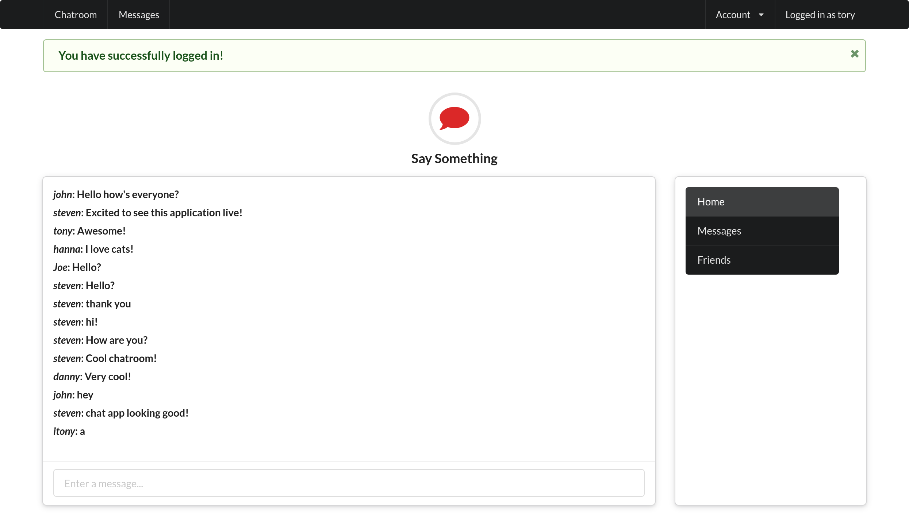

# Live Chat application using action cable
Application is a live chat system using ruby on rails and action cable
user can create an account,sign up, and begin chatting with others.

# Install
1. Install 

> $ git clone <respositoryURL>

2. Bundle install

> $ bundle install

# Use

1. start the rails server

> $ rails server

2. Go to browser and visit 

> http://localhost:3000/

## Built With

- Ruby on Rails
- VSCode

## Author

👤 **Dannison Arias**

- Github: [@dannisonarias](https://github.com/dannisonarias)
- Twitter: [@AriasDannison](https://twitter.com/AriasDannison)
- Linkedin: [Dannison Arias](https://www.linkedin.com/in/dannison-arias-777919190/)

## 🤝 Contributing

Contributions, issues and feature requests are welcome!

Feel free to check the [issues page](issues/).

## Show your support

Give a ⭐️ if you like this project!

## Acknowledgments

- Microverse
- The Odin Project

## 📝 License

This project is [MIT](./license.md) licensed.